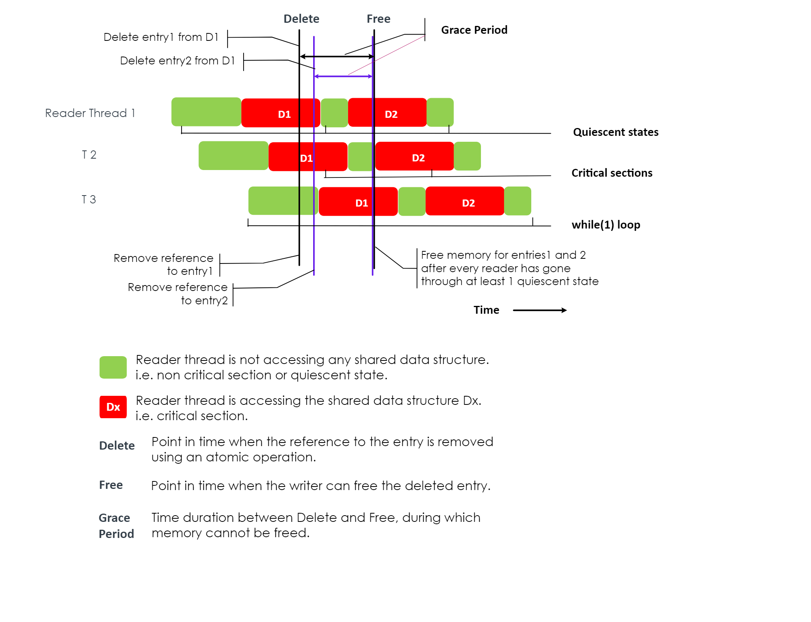

# 10.RCU库

无锁数据结构提供可扩展性和确定性。它们支持不允许锁定的用例（例如实时应用程序）。

在以下各节中，术语“内存”是指由典型 API（如 malloc()）分配的内存或任何代表内存的内容，例如空闲元素数组的索引。

由于这些数据结构是无锁的，因此写入者和读取者可以同时访问这些数据结构。因此，在从数据结构中删除元素时，编写者无法将内存返回给分配器，而不知道读者不再引用该元素/内存。因此，需要将删除元素的操作分为两个步骤：

1. 删除在此步骤中，编写器从数据结构中删除对该元素的引用，但不将关联的内存返回给分配器。这将确保新读者不会获得对已删除元素的引用。删除引用是一个原子操作。
2. 释放（回收）：在这一步中，写入者仅在知道所有读取者都已停止引用已删除元素后才将内存返回给内存分配器。

该库可帮助编写者通过使用线程静态状态 (QS) 来确定何时可以安全地释放内存。

## 10.1.什么是静态

静态状态可以定义为“线程执行中线程不持有共享内存引用的任何点”。应用程序有责任确定其静止状态。

让我们考虑下图：

图 10.1 静态模型中的各个阶段。

如图10.1所示，读取线程1访问数据结构D1和D2。当它访问 D1 时，如果写入器必须从 D1 中删除一个元素，则写入器无法立即释放与该元素关联的内存。仅当读取器停止引用 D1 后，写入器才能将内存返回给分配器。换句话说，读取器线程 RT1 必须进入静止状态。

类似地，由于读取器线程 2 也在访问 D1，因此写入器必须等到线程 2 也进入静止状态。

然而，写入器不需要等待读取器线程3进入静止状态。当删除操作发生时，读取器线程 3 未访问 D1。因此，读取器线程 3 将不会引用已删除的条目。

可以注意到，D2 的临界区是 D1 的静态。即对于给定的数据结构 Dx，线程执行中任何不引用 Dx 的点都是静止状态。

由于内存不会立即释放，因此可能需要根据应用程序要求配置额外的内存。

## 10.2.影响RCU机制的因素

重要的是要确保该库将识别宽限期结束和随后释放内存的开销保持在最低限度。以下段落解释了宽限期和临界区如何影响此开销。

writer必须对reader进行轮询以确定访问期的结束。轮询会引入内存访问并浪费 CPU 周期。在访问期内，内存不可重复使用。更长的访问期会加剧这些情况。

临界区的长度和读取器线程的数量与宽限期的持续时间成正比。保持临界区较小将使宽限期更短。然而，保持关键部分较小需要阅读器中的额外 CPU 周期（由于额外的报告）。因此，我们需要小宽限期和大临界区的特性。该库通过允许writer执行其他工作而不必阻塞直到reader报告其静态状态来解决这些特征。

## 10.3. DPDK 中的 RCU

对于 DPDK 应用程序， while(1) 循环的开始和结束（不保留对共享数据结构的引用）充当完美的静态状态。这会将所有共享数据结构访问合并到一个大的关键部分中，这有助于将读取器端的开销降至最低。

DPDK 支持数据包处理和服务核心的管道模型。在这些用例中，给定的数据结构可能不会被应用程序中的所有工作人员使用。reader只需等待使用该数据结构的worker报告其静态状态。为了提供所需的灵活性，该库有一个 QS 变量的概念。如果需要，应用程序可以为每个数据结构创建一个 QS 变量，以帮助其跟踪每个数据结构的宽限期结束。这有助于将宽限期的长度保持在最低限度。

## 10.4.如何使用这个库

