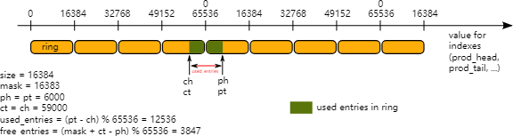

# 11. ring 库

ring 允许管理队列。 rte_ring 不是一个无限大小的链表，具有以下属性：

- FIFO
- 最大大小是固定的，对象存储在表中
- 对象可以是指针或 4 字节大小倍数的元素
- 无锁
- 多消费者或单消费者出队
- 多生产者或单生产者队列
- Bulk dequeue - 如果成功，则将指定数量的对象出队；否则失败
- Bulk enqueue - 如果成功，将指定数量的对象入队；否则失败
- Burst dequeue - 如果无法满足指定的计数，则将最大可用对象出队
- Burst enqueue - 如果无法满足指定的计数，则将最大可用对象入队

这种数据结构相对于链表队列的优点如下：
- 更快;仅需要单个 32 位比较与交换指令，而不是多个指针大小的比较与交换指令。
- 比完整的无锁队列更简单。
- 适合批量入队/出队操作。由于对象存储在表中，因此多个对象出队不会产生与链接队列中一样多的缓存未命中。此外，许多对象的批量出队并不比简单对象的出队花费更多。

缺点：
- 尺寸是固定的
- 环比链表队列在内存方面花费更多。一个空环至少包含 N 个对象。

环的简化表示如图所示，其中消费者和生产者的头指针和尾指针指向存储在数据结构中的对象。


图 11.1 环形结构

## 11.1. FreeBSD 中环实现的参考*

FreeBSD 8.0 中添加了以下代码，并在某些网络设备驱动程序中使用（至少在 Intel 驱动程序中）：

- [bufring.h in FreeBSD](http://svn.freebsd.org/viewvc/base/release/8.0.0/sys/sys/buf_ring.h?revision=199625&amp;view=markup)
- [bufring.c in FreeBSD](http://svn.freebsd.org/viewvc/base/release/8.0.0/sys/kern/subr_bufring.c?revision=199625&amp;view=markup)

## 11.2. Linux* 中的无锁环形缓冲区

以下是描述 [Linux 无锁环形缓冲区设计](http://lwn.net/Articles/340400/)的链接。

## 11.3.附加功能

### 11.3.1.名称

环由唯一的名称来标识。不可能创建两个同名的环（如果尝试这样做，rte_ring_create() 将返回 NULL）。

### 11.4.用例

Ring 库的用例包括：
- DPDK中应用程序之间的通信
- 由内存池分配器使用

## 11.5.环形缓冲区的剖析

本节介绍环形缓冲区的工作原理。环形结构由两对head和tail组成；一种由生产者使用，一种由消费者使用。以下各节的图将它们称为 `prod_head`、`prod_tail`、`cons_head` 和 `cons_tail`。

每个图代表环的简化状态，它是一个循环缓冲区。图的顶部表示函数局部变量的内容，底部表示环结构的内容。

### 11.5.1.单生产者队列

本节解释当生产者将对象添加到环中时会发生什么。本例中只修改了生产者头尾（`prod_head` 和 `prod_tail`），并且只有一个生产者。

初始状态是 `prod_head` 和 `prod_tail` 指向同一位置。

#### 11.5.1.1.入队第一步

首先，`ring->prod_head` 和 `ring->cons_tail` 被复制到局部变量中。 `prod_next` 局部变量指向表的下一个元素，或者在批量排队的情况下指向后面的几个元素。

如果环中没有足够的空间（这是通过检查 `cons_tail` 检测到的），则会返回错误。


图11.2 入队第一步

### 11.5.1.2.入队第二步

第二步是修改`ring`结构中的`ring->prod_head`，使其指向与prod_next相同的位置。

添加的对象被复制到环中（obj4）。


图11.3 入队第二步

#### 11.5.1.3.入队最后一步

一旦对象被添加到环中，环结构中的`ring->prod_tail`就会被修改为指向与`ring->prod_head`相同的位置。入队操作完成。


图 11.4 入队最后一步

### 11.5.2.单消费者出队

本节解释当消费者将对象从环中出队时会发生什么。在这个例子中，只修改了消费者 head和tail（`cons_head`和`cons_tail`），并且只有一个消费者。

初始状态是 `cons_head` 和 `cons_tail` 指向同一位置。

#### 11.5.2.1. 出队第一步

首先，`ring->cons_head` 和`ring->prod_tail` 被复制到局部变量中。 `cons_next` 局部变量指向表的下一个元素，或者在批量出队的情况下指向后面的几个元素。

如果环中没有足够的对象（这是通过检查 `prod_tail` 检测到的），则会返回错误。


图 11.5 出队第一步

#### 11.5.2.2. 出队第二步

第二步是修改ring结构中的`ring->cons_head`，使其指向与`cons_next`相同的位置。

出列的对象 (obj1) 被复制到用户指定的指针中。


图 11.6 出队第二步

#### 11.5.2.3. 出队最后一步

最后，环结构中的`ring->cons_tail`被修改为指向与`ring->cons_head`相同的位置。出队操作完成。


图 11.7 出队最后一步

### 11.5.3 多生产者入队

本节解释当两个生产者同时将一个对象添加到环中时会发生什么。在此示例中，仅修改生产者头和尾（`prod_head` 和 `prod_tail`）。

初始状态是 prod_head 和 prod_tail 指向同一位置。

#### 11.5.3.1.多生产者入队第一步

在两个核上，`ring->prod_head` 和 `ring->cons_tail` 都复制到局部变量中。 `prod_next` 局部变量指向表的下一个元素，或者在批量入队的情况下指向后面的几个元素。

如果环中没有足够的空间（这是通过检查 cons_tail 检测到的），则会返回错误。


图 11.8 多生产者入队第一步

#### 11.5.3.2.多生产者入队第二步

第二步是修改ring结构中的`ring->prod_head`，使其指向与`prod_next`相同的位置。此操作是使用比较和交换 (CAS) 指令完成的，该指令以原子方式执行以下操作：
- 如果ring->prod_head与局部变量prod_head不同，则CAS操作失败，并且代码从第一步重新开始。
- 否则，将ring->prod_head设置为本地prod_next，CAS操作成功，继续处理。

图中，操作在核心 1 上成功，步骤一在核心 2 上重新启动。


图 11.9 多生产者入队第二步

#### 11.5.3.3.多生产者入队第三步

在核心 2 上重试 CAS 操作并成功。

核心 1 更新环中的一个元素（obj4），核心 2 更新另一元素（obj5）。


图 11.10 多生产者入队第三步

#### 11.5.3.4.多生产者入队第四步

现在每个核心都想要更新`ring->prod_tail`。仅当`ring->prod_tail`等于`prod_head`局部变量时，核心才能更新它。仅在核心 1 上如此。操作在核心 1 上完成。


图 11.11 多生产者入队第四步

#### 11.5.3.5.多生产者入队最后一步

一旦 core 1 更新了`ring->prod_tail`，core 2 也可以更新它。操作也在核心2上完成。


图 11.12 多生产者入队最后一步

### 11.5.3. 32 位模索引

上图中，prod_head、prod_tail、cons_head 和 cons_tail 索引用箭头表示。在实际实现中，这些值并不像假设的那样介于 0 和 size(ring)-1 之间。索引介于 0 和 2^32 -1 之间，当我们访问对象表（环本身）时，我们会屏蔽它们的值。32 位模还意味着，如果结果溢出 32 位数字范围，索引操作（例如加/减）将自动执行 2^32 模。

以下两个示例有助于解释如何在环中使用索引。

> note:
> 为了简化说明，使用模 16 位运算而不是模 32 位运算。此外，这四个索引被定义为无符号 16 位整数，而不是更实际情况下的无符号 32 位整数。


图 11.13 32 位模索引 - 示例 1



图 11.14 32 位模索引 - 示例 2

该环包含 12536 个条目。

> note:
> 为了便于理解，我们在上面的例子中使用了模 65536 运算。在实际执行情况下，这是多余的，效率低下，但当结果溢出时会自动完成。

该代码始终将生产者和消费者之间的距离保持在 0 和 size(ring)-1 之间。由于这个属性，我们可以在模 32 位基数中的 2 个索引值之间进行减法：这就是索引溢出不是问题的原因。

在任何时候，entries 和 free_entries 都在 0 和 size(ring)-1 之间，即使只有减法的第一项溢出：

```c
uint32_t entries = (prod_tail - cons_head);
uint32_t free_entries = (mask + cons_tail -prod_head);
```

## 11.6.生产者/消费者同步模式

rte_ring支持生产者和消费者不同的同步模式。这些模式可以在环创建/初始化时通过 `flags` 参数指定。这应该可以帮助用户以最适合其特定使用场景的方式配置环。目前支持的模式：

### 11.6.1 MP/MC（默认）

多生产者（/多消费者）模式。这是环的默认入队（/出队）模式。在此模式下，多个线程可以将对象入队（/出队）到环中（/从环中取出）。对于“经典”DPDK 部署（每个核心一个线程），这通常是最合适且最快的同步模式。作为一个众所周知的限制 - 它可以在某些过度使用的场景中表现得非常纯粹。

### 11.6.2. SP/SC

单生产者（/单消费者）模式。在此模式下，一次只允许一个线程将对象入队（/出队）到环中（/从环中取出）。

### 11.6.3. MP_RTS/MC_RTS

具有宽松尾同步 (Relaxed Tail Sync, RTS) 模式的多生产者（/多消费者）。与原始 MP/MC 算法的主要区别在于，tail 值不是由每个完成入队/出队的线程增加，而是仅由最后一个线程增加。这允许线程避免在环尾值上旋转，将实际尾值更改留给给定实例的最后一个线程。该技术有助于避免尾部更新时的锁等待抢占 (LWP) 问题，并改善过度使用的系统上的平均入队/出队时间。为了实现 RTS，每个入队（/出队）操作需要 2 个 64 位 CAS：一个用于头部更新，第二个用于尾部更新。相比之下，原始 MP/MC 算法需要一个 32 位 CAS 来进行头部更新和等待/旋转尾部值。

### 11.6.4. MP_HTS/MC_HTS

具有头/尾同步 (Head/Tail Sync, HTS) 模式的多生产者（/多消费者）。在该模式下，入队/出队操作是完全串行化的：在任何给定时刻，只能进行一个入队/出队操作。这是通过仅当 head.value == tail.value 时允许线程继续更改 head.value 来实现的。头值和尾值均以原子方式更新（作为一个 64 位值）。为了实现该目的，头更新例程使用 64 位 CAS。该技术还避免了尾部更新时的锁等待抢占 (LWP) 问题，并有助于改善过度使用场景中的环入队/出队行为。完全序列化的生产者/消费者的另一个优点 - 它提供了为 rte_ring 实现 MT 安全查看 API 的能力。

## 11.7.环监控API

对于具有序列化生产者/消费者（HTS 同步模式）的环，可以将公共入队/出队 API 分为两个阶段：

- 入队/出队开始 
- 入队/出队完成

这允许用户检查环中的对象，而无需将其从环中移除（也称为 MT 安全查看），并在实际入队之前为环中的对象保留空间。请注意，此 API 仅适用于两种同步模式：

- 单生产者/单消费者 (SP/SC)
- 具有头/尾同步 (HTS) 的多生产者/多消费者

用户有责任创建/初始化环并选择适当的同步模式。作为用法示例：

```c
/* read 1 elem from the ring: */
uint32_t n = rte_ring_dequeue_bulk_start(ring, &obj, 1, NULL);
if (n != 0) {
    /* examine object */
    if (object_examine(obj) == KEEP)
        /* decided to keep it in the ring. */
        rte_ring_dequeue_finish(ring, 0);
    else
        /* decided to remove it from the ring. */
        rte_ring_dequeue_finish(ring, n);
}
```

请注意，在 _start_ 和 _finish_ 之间，没有其他线程可以继续进行入队（/出队）操作，直到 _finish_ 完成。

## 11.8. 环监控零拷贝 API

除了 peek API 的优点之外，零复制 API 还提供了将数据直接复制到环形内存的能力，而无需临时存储（例如：堆栈上的 mbuf 数组）。

这些 API 可以将公共入队/出队 API 分为 3 个阶段：
- 入队/出队开始 
- 将数据复制到环或从环复制数据 
- 入队/出队完成

请注意，此 API 仅适用于两种同步模式：
- 单一生产者/单一消费者 (SP/SC) 
- 具有头/尾同步 (HTS) 的多生产者/多消费者

用户有责任使用适当的同步模式创建/初始化环。下面是一个使用示例：

```c
/* Reserve space on the ring */
n = rte_ring_enqueue_zc_burst_start(r, 32, &zcd, NULL);
/* Pkt I/O core polls packets from the NIC */
if (n != 0) {
    nb_rx = rte_eth_rx_burst(portid, queueid, zcd->ptr1, zcd->n1);
    if (nb_rx == zcd->n1 && n != zcd->n1)
        nb_rx += rte_eth_rx_burst(portid, queueid, zcd->ptr2,
                                                    n - zcd->n1);
    /* Provide packets to the packet processing cores */
    rte_ring_enqueue_zc_finish(r, nb_rx);
}
```

请注意，在 _start_ 和 _finish_ 之间，没有其他线程可以继续进行入队（/出队）操作，直到 _finish_ 完成。

## 11.9.参考

- [bufring.h in FreeBSD](http://svn.freebsd.org/viewvc/base/release/8.0.0/sys/sys/buf_ring.h?revision=199625&amp;view=markup) (version 8)
- [bufring.c in FreeBSD](http://svn.freebsd.org/viewvc/base/release/8.0.0/sys/kern/subr_bufring.c?revision=199625&amp;view=markup) (version 8)
- [Linux Lockless Ring Buffer Design](http://lwn.net/Articles/340400/)
