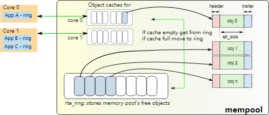

# 13.内存池库

内存池是固定大小对象的分配器。在DPDK中，它通过名称来标识，并使用内存池处理程序来存储空闲对象。默认的内存池处理程序是基于环的。它提供了一些其他可选服务，例如每核心对象缓存和对齐助手，以确保填充对象以将它们均匀地分布在所有 DRAM 或 DDR3 通道上。

该库由 [Mbuf 库](https://doc.dpdk.org/guides/prog_guide/mbuf_lib.html#mbuf-library)使用。

## 13.1.cookies

在调试模式下，cookie 添加在分配块的开头和结尾。然后，分配的对象包含覆盖保护字段，以帮助调试缓冲区溢出。

调试模式默认处于禁用状态，但可以通过在 `config/rte_config.h` 中设置 `RTE_LIBRTE_MEMPOOL_DEBUG` 来启用。

## 13.2.统计数据

在统计模式下，有关池中获取/放入的统计信息存储在内存池结构中。统计信息是针对每个 lcore 的，以避免并发访问统计计数器。

统计模式默认处于禁用状态，但可以通过在 `config/rte_config.h` 中设置 `RTE_LIBRTE_MEMPOOL_STATS` 来启用。

## 13.3. x86 架构上的内存对齐约束

根据X86架构上的硬件内存配置，通过在对象之间添加特定的填充可以极大地提高性能。目标是确保每个对象的开头在不同的通道上开始并在内存中排列，以便所有通道均等加载。

对于进行 L3 转发或流分类时的数据包缓冲区来说尤其如此。仅访问前 64 个字节，因此可以通过在不同通道之间分散对象的起始地址来提高性能。

任何 DIMM 上的列数是可访问 DIMM 完整数据位宽的独立 DRAM 组的数量。无法同时访问这些列，因为它们共享相同的数据路径。DIMM 本身上 DRAM 芯片的物理布局并不一定与列数相关。

运行应用程序时，EAL 命令行选项提供添加内存通道和列数的功能。

> note:
> 命令行必须始终具有为处理器指定的内存通道数。

不同 DIMM 架构的对齐示例如图 13.1 和图 13.2 所示。

图 13.1 两个通道和四列 DIMM 示例

在这种情况下，假设数据包是 16 个 64 字节的块，但事实并非如此。

英特尔® 5520 芯片组具有三个通道，因此在大多数情况下，对象之间不需要填充（大小为 n x 3 x 64 字节块的对象除外）。

图 13.2 三个通道和两个双列 DIMM 示例

创建新池时，用户可以指定是否使用此功能。

## 13.4. 本地缓存

就 CPU 使用率而言，多个内核访问内存池的空闲缓冲区环的成本可能很高，因为每次访问都需要比较和设置 (compare-and-set, CAS) 操作。为了避免对内存池环有太多的访问请求，内存池分配器可以维护每个核心的缓存，并通过缓存对实际内存池结构上的锁进行批量请求。这样，每个核心都可以完全访问自己的空闲对象缓存（带锁），并且只有当缓存填满时，核心才需要将一些空闲对象清除回内存池或在缓存满时获取更多空对象。

虽然这可能意味着某些核心的缓存上可能有多个缓冲区处于空闲状态，但核心在没有锁的情况下访问自己特定内存池缓存的速度可以提升性能。

缓存由一个小型的、每个核心的指针表及其长度（用作堆栈）组成。可以在创建池时启用或禁用此内部缓存。

缓存的最大大小是静态的，并在编译时定义（`RTE_MEMPOOL_CACHE_MAX_SIZE`）。

图 13.3 显示了运行中的缓存。

图 13.3 内存中的内存池及其关联环

除了内部默认的每 lcore 本地缓存之外，应用程序还可以通过 `rte_mempool_cache_create()`、`rte_mempool_cache_free()` 和 `rte_mempool_cache_flush()` 调用创建和管理外部缓存。这些用户拥有的缓存可以显式传递给 `rte_mempool_generic_put()` 和 `rte_mempool_generic_get()`。`rte_mempool_default_cache()` 调用返回默认内部缓存（如果有）。与默认缓存相反，用户拥有的缓存也可以由未注册的非 EAL 线程使用。

## 13.5.内存池处理程序

这允许外部内存子系统（例如外部硬件内存管理系统和基于软件的内存分配器）与 DPDK 一起使用。

内存池处理程序有两个方面。
- 添加新内存池操作 (ops) 的代码。这是通过添加新的内存池操作代码并使用 `RTE_MEMPOOL_REGISTER_OPS` 宏来实现的。
- 使用新的 API 调用 `rte_mempool_create_empty()` 和 `rte_mempool_set_ops_byname()` 来创建新的内存池并指定要使用的操作。

同一应用程序中可以使用多个不同的内存池处理程序。可以使用 `rte_mempool_create_empty()` 函数创建新的内存池，然后使用 `rte_mempool_set_ops_byname()` 将内存池指向相关的内存池处理程序回调（ops）结构。

旧应用程序可能会继续使用旧的 `rte_mempool_create()` API 调用，该调用默认使用基于环的内存池处理程序。这些应用程序需要修改才能使用新的内存池处理程序。

对于使用 `rte_pktmbuf_create()` 的应用程序，有一个配置设置 (`RTE_MBUF_DEFAULT_MEMPOOL_OPS`) 允许应用程序使用替代内存池处理程序。

> note:
> 当使用共享库运行 DPDK 应用程序时，会动态加载使用“-d”EAL 命令行参数指定的内存池处理程序共享对象。当使用共享库运行多进程应用程序时，必须以相同的顺序为所有进程指定内存池处理程序的 -d 参数，以确保正确操作。

## 13.6. 用例

所有需要高性能的分配都应该使用基于池的内存分配器。以下是一些示例：
- Mbuf库
- 环境抽象层，用于日志服务
- 任何需要在数据平面中分配固定大小对象并且将被系统持续使用的应用程序。

