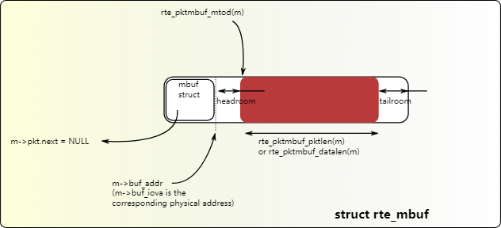
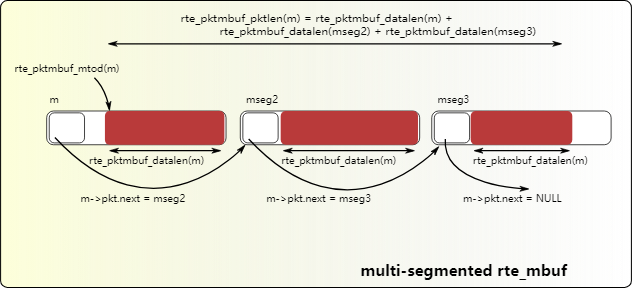

# 14.Mbuf库

mbuf 库提供了分配和释放缓冲区 (mbuf) 的能力，DPDK 应用程序可以使用这些缓冲区来存储消息缓冲区。消息缓冲区使用内存池库存储在[内存池](https://doc.dpdk.org/guides/prog_guide/mempool_lib.html#mempool-library)中。

rte_mbuf 结构体通常承载网络数据包缓冲区，但它实际上可以是任何数据（控制数据、事件等）。rte_mbuf 标头结构保持尽可能小，当前仅使用两个缓存行，最常用的字段位于两个缓存行中的第一个。

## 14.1.数据包缓冲区的设计

对于数据包数据（包括协议头）的存储，考虑了两种方法：
1. 将元数据嵌入到单个内存缓冲区结构中，后跟用于数据包数据的固定大小区域。
2. 对元数据结构和数据包数据使用单独的内存缓冲区。

第一种方法的优点是它只需要一个操作来分配/释放数据包的整个内存表示。另一方面，第二种方法更加灵活，并且允许元数据结构的分配与分组数据缓冲区的分配完全分离。

DPDK 选择第一种方法。元数据包含控制信息，例如消息类型、长度、数据开头的偏移量以及允许缓冲区链接的附加 mbuf 结构的指针。

用于承载网络数据包的消息缓冲区可以处理缓冲区链接，其中需要多个缓冲区来保存完整的数据包。巨型帧就是这种情况，它由许多通过其下一个字段链接在一起的 mbuf 组成。

对于新分配的 mbuf，消息缓冲区中数据开始的区域是缓冲区开始之后的 `RTE_PKTMBUF_HEADROOM` 字节，该区域是缓存对齐的。消息缓冲器可用于在系统中的不同实体之间传送控制信息、数据包、事件等。消息缓冲区还可以使用它们的缓冲区指针来指向其他消息缓冲区数据部分或其他结构。

图 14.2 和图 14.3 显示了其中一些场景。



图 14.2 具有一个段的 mbuf



图 14.3 具有三段的 mbuf

缓冲区管理器实现了一组相当标准的缓冲区访问函数来操作网络数据包。

## 14.2.存储在内存池中的缓冲区

缓冲区管理器使用 Mempool 库来分配缓冲区。因此，它确保数据包标头在通道和等级之间进行最佳交织，以进行 L3 处理。mbuf 包含一个字段，指示它源自的池。当调用 rte_pktmbuf_free(m) 时，mbuf 返回到其原始池。

## 14.3.构造函数

数据包 mbuf 构造函数由 API 提供。rte_pktmbuf_init() 函数初始化 mbuf 结构中的一些字段，这些字段一旦创建就不会被用户修改（mbuf 类型、原始池、缓冲区起始地址等）。该函数在池创建时作为 rte_mempool_create() 函数的回调函数给出。

## 14.4.分配和释放 mbuf

分配新的 mbuf 需要用户指定应从中获取 mbuf 的内存池。对于任何新分配的 mbuf，它包含一个段，长度为 0。数据偏移量被初始化为在缓冲区中拥有一些字节的净空 (RTE_PKTMBUF_HEADROOM)。

释放 mbuf 意味着将其返回到原来的内存池中。当 mbuf 存储在池中（作为空闲 mbuf）时，其内容不会被修改。由构造函数初始化的字段不需要在 mbuf 分配时重新初始化。

当释放包含多个段的数据包 mbuf 时，所有段都将被释放并返回到其原始内存池。

## 14.5.操作 mbuf

该库提供了一些用于操作数据包 mbuf 中的数据的函数。例如：
- 获取数据长度
- 获取指向数据开头的指针
- 在数据之前添加数据
- 在数据后面追加数据
- 删除缓冲区开头的数据（rte_pktmbuf_adj()）
- 删除缓冲区末尾的数据 (rte_pktmbuf_trim()) 有关详细信息，请参阅 DPDK API 参考。

## 14.6.元信息

一些信息由网络驱动程序检索并存储在 mbuf 中，以便于处理。例如，VLAN、RSS 哈希结果（请参[阅轮询模式驱动程序](https://doc.dpdk.org/guides/prog_guide/poll_mode_drv.html#poll-mode-driver)）以及指示校验和由硬件计算的标志。

mbuf 还包含输入端口（它来自哪里）以及链中的段 mbuf 数量。

对于链式缓冲区，只有链的第一个 mbuf 存储此元信息。

例如，RX 侧的 IEEE1588 数据包时间戳机制、VLAN 标记和 IP 校验和计算就是这种情况。

在 TX 端，如果硬件支持，应用程序也可以将某些处理委托给硬件。例如，RTE_MBUF_F_TX_IP_CKSUM 标志允许卸载 IPv4 校验和的计算。


以下示例说明如何在 vxlan 封装的 tcp 数据包上配置不同的 TX 卸载： `out_eth/out_ip/out_udp/vxlan/in_eth/in_ip/in_tcp/payload`

- 计算out_ip的校验和：
```c
mb->l2_len = len(out_eth)
mb->l3_len = len(out_ip)
mb->ol_flags |= RTE_MBUF_F_TX_IPV4 | RTE_MBUF_F_TX_IP_CSUM
set out_ip checksum to 0 in the packet
```

硬件通告 `RTE_ETH_TX_OFFLOAD_IPV4_CKSUM` 支持此功能。

- 计算out_ip和out_udp的校验和：
```c
mb->l2_len = len(out_eth)
mb->l3_len = len(out_ip)
mb->ol_flags |= RTE_MBUF_F_TX_IPV4 | RTE_MBUF_F_TX_IP_CSUM | RTE_MBUF_F_TX_UDP_CKSUM
set out_ip checksum to 0 in the packet
set out_udp checksum to pseudo header using rte_ipv4_phdr_cksum()
```

硬件通告 `RTE_ETH_TX_OFFLOAD_IPV4_CKSUM` 和 `RTE_ETH_TX_OFFLOAD_UDP_CKSUM` 支持此功能。

- 计算in_ip的校验和：
```c
mb->l2_len = len(out_eth + out_ip + out_udp + vxlan + in_eth)
mb->l3_len = len(in_ip)
mb->ol_flags |= RTE_MBUF_F_TX_IPV4 | RTE_MBUF_F_TX_IP_CSUM
set in_ip checksum to 0 in the packet
```

这与情况1)类似，但l2_len不同。它在硬件通告`RTE_ETH_TX_OFFLOAD_IPV4_CKSUM` 上受支持。请注意，只有外部 L4 校验和为 0 时，它才有效。

- 计算in_ip和in_tcp的校验和：
```c
mb->l2_len = len(out_eth + out_ip + out_udp + vxlan + in_eth)
mb->l3_len = len(in_ip)
mb->ol_flags |= RTE_MBUF_F_TX_IPV4 | RTE_MBUF_F_TX_IP_CSUM | RTE_MBUF_F_TX_TCP_CKSUM
set in_ip checksum to 0 in the packet
set in_tcp checksum to pseudo header using rte_ipv4_phdr_cksum()
```

这与情况2)类似，但l2_len不同。它在硬件通告 `RTE_ETH_TX_OFFLOAD_IPV4_CKSUM` 和 `RTE_ETH_TX_OFFLOAD_TCP_CKSUM` 上受支持。请注意，只有外部 L4 校验和为 0 时，它才有效。

- 段内部 TCP：
```c
mb->l2_len = len(out_eth + out_ip + out_udp + vxlan + in_eth)
mb->l3_len = len(in_ip)
mb->l4_len = len(in_tcp)
mb->ol_flags |= RTE_MBUF_F_TX_IPV4 | RTE_MBUF_F_TX_IP_CKSUM | RTE_MBUF_F_TX_TCP_CKSUM |
  RTE_MBUF_F_TX_TCP_SEG;
set in_ip checksum to 0 in the packet
set in_tcp checksum to pseudo header without including the IP
  payload length using rte_ipv4_phdr_cksum()
```

硬件通告 `RTE_ETH_TX_OFFLOAD_TCP_TSO` 支持此功能。请注意，只有外部 L4 校验和为 0 时，它才有效。

- 计算out_ip、in_ip、in_tcp的校验和：
```c
mb->outer_l2_len = len(out_eth)
mb->outer_l3_len = len(out_ip)
mb->l2_len = len(out_udp + vxlan + in_eth)
mb->l3_len = len(in_ip)
mb->ol_flags |= RTE_MBUF_F_TX_OUTER_IPV4 | RTE_MBUF_F_TX_OUTER_IP_CKSUM  | \
  RTE_MBUF_F_TX_IP_CKSUM |  RTE_MBUF_F_TX_TCP_CKSUM;
set out_ip checksum to 0 in the packet
set in_ip checksum to 0 in the packet
set in_tcp checksum to pseudo header using rte_ipv4_phdr_cksum()
```

硬件通告 `RTE_ETH_TX_OFFLOAD_IPV4_CKSUM`、`RTE_ETH_TX_OFFLOAD_UDP_CKSUM` 和 `RTE_ETH_TX_OFFLOAD_OUTER_IPV4_CKSUM` 支持此功能。

mbuf API 文档 (rte_mbuf.h) 中描述了标志列表及其精确含义。另请参阅 testpmd 源代码（特别是 csumonly.c 文件）以了解详细信息。

### 14.6.1.动态字段和标志

mbuf的大小受到约束和限制；而为每个数据包保存的元数据量却是无限的。最基本的网络信息已经在现有的 mbuf 字段和标志中找到了自己的位置。

如果需要添加新功能，则通过在 mbuf 结构中注册一些空间，新字段和标志应适合“动态空间”：
- 动态字段:mbuf 结构中的命名区域，具有给定的大小（至少 1 字节）和对齐约束。
- 动态标志:mbuf 结构中的命名位，存储在字段ol_flags中。

动态字段和标志由函数 rte_mbuf_dyn* 管理。

无法取消注册字段或标志。

## 14.7.直接和间接缓冲区

直接缓冲区是完全独立且独立的缓冲区。间接缓冲区的行为类似于直接缓冲区，但事实上，其中的缓冲区指针和数据偏移量引用另一个直接缓冲区中的数据。这在数据包需要复制或分段的情况下非常有用，因为间接缓冲区提供了跨多个缓冲区重用相同数据包数据的方法。

当使用 `rte_pktmbuf_attach()` 函数“附加”到直接缓冲区时，缓冲区将变为间接缓冲区。每个缓冲区都有一个引用计数器字段，每当间接缓冲区连接到直接缓冲区时，直接缓冲区上的引用计数器就会递增。类似地，每当间接缓冲区被分离时，直接缓冲区上的引用计数器就会递减。如果结果引用计数器等于 0，则直接缓冲区将被释放，因为它不再使用。

处理间接缓冲区时需要记住一些事情。首先，间接缓冲区永远不会附加到另一个间接缓冲区。尝试将缓冲区 A 连接到附加到 C 的间接缓冲区 B，`rte_pktmbuf_attach()` 会自动将 A 连接到 C，从而有效地克隆 B。

其次，要使缓冲区成为间接缓冲区，其引用计数器必须等于 1，即它不能已被另一个间接缓冲区引用。最后，不可能将间接缓冲区重新附加到直接缓冲区（除非先将其分离）。

虽然可以使用推荐的 `rte_pktmbuf_attach()` 和 `rte_pktmbuf_detach()` 函数直接调用附加/分离操作，但是仍然建议使用更高级别的 `rte_pktmbuf_clone()` 函数，该函数负责间接缓冲区的正确初始化，并可以克隆具有多个段的缓冲区。

由于间接缓冲区实际上不应保存任何数据，因此应配置间接缓冲区的内存池以指示减少的内存消耗。间接缓冲区内存池的初始化示例（以及间接缓冲区的用例示例）可以在多个示例应用程序中找到，例如 IPv4 多播示例应用程序。

## 14.8.调试

在调试模式下，mbuf 库的函数在任何操作（例如缓冲区损坏、错误类型等）之前执行健全性检查。 

## 14.9.用例

所有网络应用程序都应该使用 mbufs 来传输网络数据包。