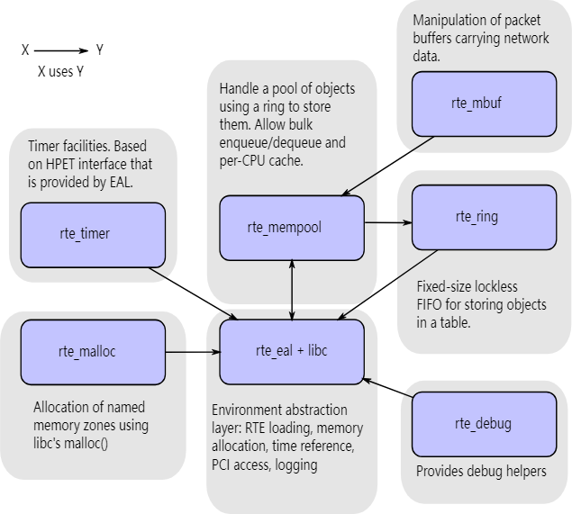

# 2. 概述

本节对数据平面开发套件 (Data Plane Development Kit, DPDK) 的架构进行总体概述。

DPDK 的主要目标是提供一个简单、完整的框架用于在数据面应用中快速处理数据包。用户可以使用代码来理解所采用的一些技术、构建原型或添加自己的协议栈。可以使用使用 DPDK 的替代操作系统选项。

该框架通过创建环境抽象层 (Environment Abstraction Layer， EAL) 为特定环境创建一组库，该层可能特定于英特尔® 架构模式（32 位或 64 位）、Linux* 用户空间编译器或一个特定的平台。这些环境是通过使用 meson 文件和 configuration 文件创建的。一旦创建了 EAL 库，用户就可以与该库链接来创建自己的应用程序。除 EAL 之外，还提供了 hash、最长前缀匹配 (LPM, Longest Prefix Match) 和 rings 等其他库。还提供示例应用程序来帮助向用户展示如何使用 DPDK 的各种功能。

DPDK 实现了一个 run-to-completion 的数据包处理模型，但是必须在调用数据平面应用程序之前分配所有资源，并作为逻辑处理核心上的执行单元运行。该模型不支持调度程序，所有设备均通过轮询访问。不使用中断的主要原因是中断处理带来的性能开销。

除了 run-to-completion 模型，也可以使用管道模型，通过 rings 在核之间传递数据包或消息。这允许分阶段执行工作，并且可以更有效地使用内核上的代码。

## 2.1.开发环境

DPDK 项目安装需要 Linux 和相关的工具链，例如一个或多个编译器、汇编器、meson 工具、编辑器和各种库来创建 DPDK 组件和库。

一旦为特定环境和架构创建了这些库，它们就可以用于创建用户的数据平面应用程序。

为 Linux 用户空间创建应用程序时，会使用 glibc 库。

有关设置开发环境的信息，请参阅 *DPDK Getting Started Guide*。

## 2.2.Environment Abstraction Layer

环境抽象层 (Environment Abstraction Layer, EAL) 提供了一个通用接口，可对应用程序和库隐藏环境细节。 EAL 提供的服务有：
- DPDK 加载和启动
- 支持多进程和多线程执行类型
- 内核关联/分配程序
- 系统内存分配/解释放
- 原子/锁操作
- 时间相关
- PCI 总线访问
- 跟踪和调试功能
- CPU 特性识别
- 中断处理
- 报警操作
- 内存管理（malloc）

EAL 在 [Environment Abstraction Layer](https://doc.dpdk.org/guides/prog_guide/env_abstraction_layer.html#environment-abstraction-layer) 中有完整描述。

## 2.3.核心组件

核心组件是一组库，提供高性能数据包处理应用程序所需的所有元素。

### 2.3.1.ring 管理器 (librte_ring)

ring 在有限大小的表中提供无锁的多生产者、多消费者 FIFO API。与无锁队列相比，它有一些优点；更容易实施，适应批量操作并且速度更快。ring 由 [Memory Pool Manager (librte_mempool)](https://doc.dpdk.org/guides/prog_guide/mempool_lib.html#mempool-library) 使用，并且可以用作连接在逻辑核上的核和/或执行块之间的通用通信机制。

[Ring Library](https://doc.dpdk.org/guides/prog_guide/ring_lib.html#ring-library) 中完整描述了 ring buffer 及其用法。

### 2.3.2 内存池管理器 (librte_mempool)

内存池管理器负责分配内存中的对象池。池通过名称来标识，并使用 ring 来存储空闲对象。它提供了一些其他可选服务，例如每个核心的对象缓存和对齐助手，以确保对象被填充以将它们均匀地分布在所有 RAM 通道上。

[Mempool Library](https://doc.dpdk.org/guides/prog_guide/mempool_lib.html#mempool-library) 中描述了内存池分配器。

### 2.3.3.网络数据包缓冲区管理 (librte_mbuf)

mbuf 库提供了创建和销毁缓冲区的工具，DPDK 应用程序可以使用这些缓冲区来存储消息。消息缓冲区在启动时创建并使用 DPDK mempool 库存储在内存池中。

该库提供了一个 API 来分配/释放 mbuf，操作用于承载网络数据包的数据包缓冲区。

[Mbuf Library](https://doc.dpdk.org/guides/prog_guide/mbuf_lib.html#mbuf-library)中描述了网络数据包缓冲区管理器。

### 2.3.4.定时器管理器 (librte_timer)

该库为 DPDK 执行单元提供定时器服务，提供异步执行函数的能力。它可以是周期性的函数调用，也可以只是一次性调用。它使用环境抽象层 (EAL) 提供的计时器接口来获取精确的时间参考，并且可以根据需要在每个核心的基础上启动。

[Timer Library](https://doc.dpdk.org/guides/prog_guide/timer_lib.html#timer-library)中提供了库文档。

## 2.4.Ethernet* 轮询模式驱动程序架构

DPDK 包括适用于 1 GbE、10 GbE 和 40 GbE 的轮询模式驱动程序 (PMD) 以及半虚拟化 virtio 以太网控制器，这些控制器设计为无需异步、基于中断的信号机制即可工作。

请参阅 [ Poll Mode Driver](https://doc.dpdk.org/guides/prog_guide/poll_mode_drv.html#poll-mode-driver)。

## 2.5.数据包转发算法支持

DPDK 包含哈希（librte_hash）和最长前缀匹配（Longest Prefix Match, LPM，librte_lpm）库来支持相应的数据包转发算法。

有关详细信息，请参阅 [Hash Library](https://doc.dpdk.org/guides/prog_guide/hash_lib.html#hash-library) 和 [LPM Library](https://doc.dpdk.org/guides/prog_guide/lpm_lib.html#lpm-library)。

## 2.6. librte_net

librte_net 库是 IP 协议定义和便利宏的集合。它基于 FreeBSD* IP 堆栈的代码，包含协议号（用于 IP 标头）、IP 相关宏、IPv4/IPv6 标头结构以及 TCP、UDP 和 SCTP 标头结构。

