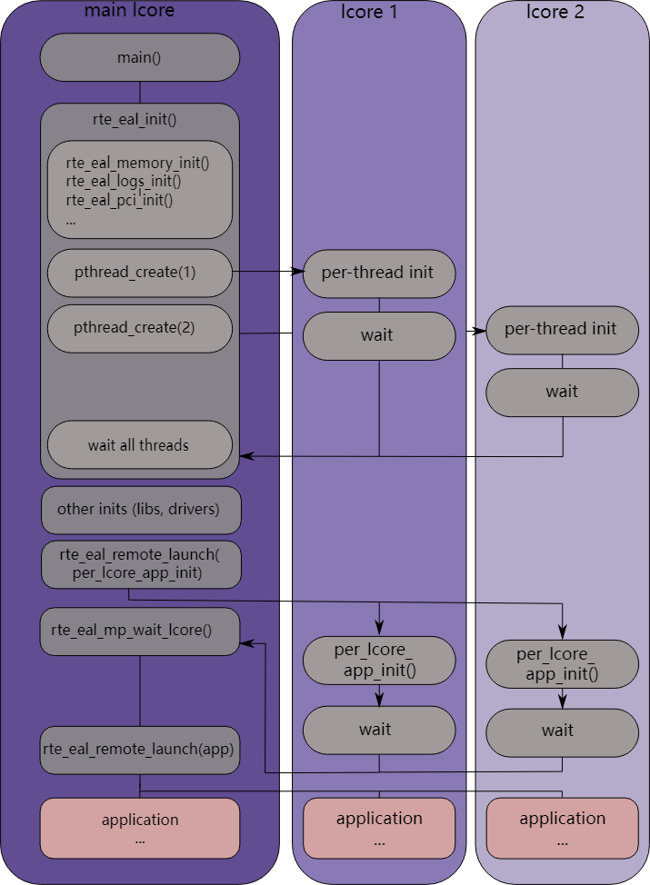

# 2. 概述

本节对数据平面开发套件 (DPDK) 的架构进行总体概述。

DPDK 的主要目标是为数据平面应用中的快速数据包处理提供一个简单、完整的框架。用户可以使用代码来理解所采用的一些技术、构建原型或添加自己的协议栈。可以使用使用 DPDK 的替代系统选项。

该框架通过创建环境抽象层 (EAL, Environment Abstraction Layer) 为特定环境创建一组库，该层可能特定于英特尔® 架构模式（32 位或 64 位）、Linux* 用户空间编译器或一个特定的平台。这些环境是通过使用 meson 文件和 configuration 文件创建的。一旦创建了 EAL 库，用户就可以与该库链接来创建自己的应用程序。还提供 EAL 之外的其他库，包括 hash、最长前缀匹配 (LPM, Longest Prefix Match) 和 rings 库。提供示例应用程序来帮助向用户展示如何使用 DPDK 的各种功能。

DPDK 实现了数据包处理的运行到完成模型，其中必须在调用数据平面应用程序之前分配所有资源，并作为逻辑处理核心上的执行单元运行。该模型不支持调度程序，所有设备均通过轮询访问。不使用中断的主要原因是中断处理带来的性能开销。

除了运行到完成模型之外，还可以通过通过环在核之间传递数据包或消息来使用管道模型。这允许分阶段执行工作，并且可以更有效地使用内核上的代码。

## 2.1.开发环境

DPDK项目安装需要 Linux 和相关的工具链，例如一个或多个编译器、汇编器、meson 工具、编辑器和各种库来创建 DPDK 组件和库。

一旦为特定环境和架构创建了这些库，它们就可以用于创建用户的数据平面应用程序。

为 Linux 用户空间创建应用程序时，会使用 glibc 库。

有关设置开发环境的信息，请参阅 *DPDK Getting Started Guide*。

## 2.2.环境抽象层

环境抽象层 (EAL) 提供了一个通用接口，可对应用程序和库隐藏环境细节。 EAL 提供的服务有：
- DPDK加载和启动
- 支持多进程和多线程执行类型
- 核心关联/分配程序
- 系统内存分配/解除分配
- 原子/锁操作
- 时间参考
- PCI总线访问
- 跟踪和调试功能
- CPU特性识别
- 中断处理
- 报警操作
- 内存管理（malloc）

EAL 在[环境抽象层](https://doc.dpdk.org/guides/prog_guide/env_abstraction_layer.html#environment-abstraction-layer)中有完整描述。

## 2.3.核心组件

核心组件是一组库，提供高性能数据包处理应用程序所需的所有元素。

### 2.3.1.ring 管理器 (librte_ring)

ring 在有限大小的表中提供无锁的多生产者、多消费者 FIFO API。与无锁队列相比，它有一些优点；更容易实施，适应批量操作并且速度更快。环由[内存池管理器（librte_mempool）](https://doc.dpdk.org/guides/prog_guide/mempool_lib.html#mempool-library) 使用，并且可以用作逻辑核心上连接在一起的核心和/或执行块之间的通用通信机制。

[Ring Library](https://doc.dpdk.org/guides/prog_guide/ring_lib.html#ring-library) 中完整描述了该环形缓冲区及其用法。

