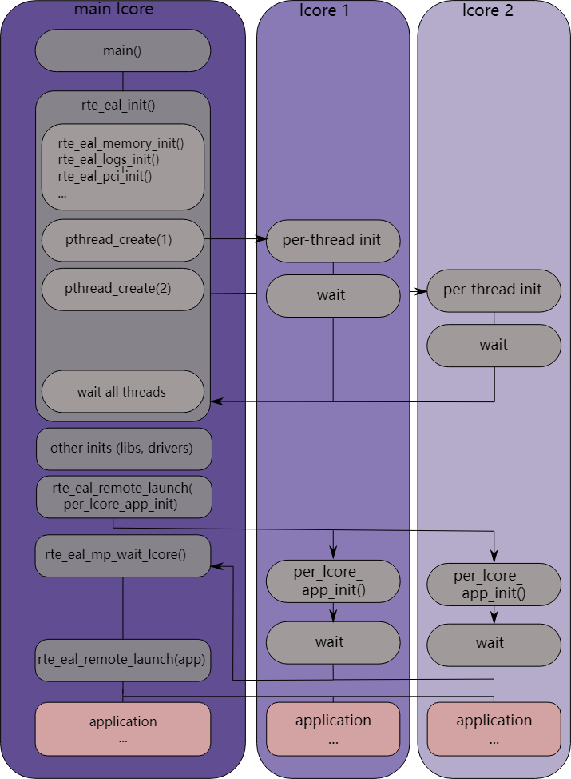

# 4.环境抽象层

环境抽象层 (EAL, Environment Abstraction Layer) 负责访问低级资源，例如硬件和内存空间。它提供了一个通用接口，对应用程序和库隐藏了环境细节。初始化例程负责决定如何分配这些资源（即内存空间、设备、定时器、控制台等）。

期望 EAL 提供的典型服务包括：
- DPDK加载和启动：DPDK 及其应用程序作为单个应用程序链接，必须通过某种方式加载。
- 核心关联/分配过程：EAL 提供了将执行单元分配给特定核以及创建执行实例的机制。
- 系统内存预留​​：EAL 有助于预留不同的内存区域，例如用于设备交互的物理内存区域。
- 跟踪和调试功能：日志、dump_stack、panic 等。
- 实用函数：libc 中未提供的自旋锁和原子计数器。
- CPU 功能识别：在运行时确定是否支持特定功能，例如英特尔® AVX。确定当前 CPU 是否支持二进制文件编译所针对的功能集。
- 中断处理：注册/取消注册特定中断源回调的接口。
- 警报功能：设置/删除在特定时间运行的回调的接口。

## 4.1. Linux 用户态执行环境中的 EAL

在 Linux 用户空间环境中，DPDK 应用程序使用 pthread 库作为用户空间应用程序运行。

EAL 使用 Hugetlbfs 中的 mmap() 执行物理内存分配（使用大页面大小来提高性能）。该内存暴露给 DPDK 服务层，例如 [Mempool 库](https://doc.dpdk.org/guides/prog_guide/mempool_lib.html#mempool-library)。

此时，DPDK服务层将被初始化，然后通过 pthread setaffinity 调用，每个执行单元将被分配到特定的逻辑核心以作为用户级线程运行。

时间参考由 CPU 时间戳计数器 (TSC, Time-Stamp Counter) 或 HPET 内核 API 通过 mmap() 调用提供。

### 4.1.1.初始化和核心启动

部分初始化是由glibc的start函数完成的。初始化时还会执行检查，以确保 CPU 支持配置文件中选择的微架构类型。然后，调用 main() 函数。核心初始化和启动在 rte_eal_init() 中完成（请参阅 API 文档）。它由对 pthread 库（更具体地说，pthread_self()、pthread_create() 和 pthread_setaffinity_np()）的调用组成。


图 4.1 Linux 应用环境中的 EAL 初始化

> note:
> 对象（例如内存区域、环、内存池、lpm 表和哈希表）的初始化应作为主 lcore 上整个应用程序初始化的一部分来完成。这些对象的创建和初始化函数不是多线程安全的。然而，一旦初始化，对象本身就可以安全地同时在多个线程中使用。

### 4.1.2.关闭和清理

在 EAL 初始化期间，资源（例如大页内存支持）可以由核心组件分配。 `rte_eal_init()` 期间分配的内存可以通过调用 `rte_eal_cleanup()` 函数来释放。详细信息请参阅 API 文档。

### 4.1.3.多进程支持

Linux EAL 允许多进程以及多线程 (pthread) 部署模型。有关更多详细信息，请参阅[多进程支持](https://doc.dpdk.org/guides/prog_guide/multi_proc_support.html#multi-process-support)一章。

### 4.1.4.内存映射发现和内存预留

大型连续物理内存的分配是使用大页完成的。 EAL 提供了一个 API 来在此连续内存中保留命名内存区域。该内存区域的预留内存的物理地址也由内存区域预留 API 返回给用户。DPDK 内存子系统可以运行两种模式：动态模式和传统模式。下面对这两种模式进行了解释。

> note:
> 使用 rte_malloc 提供的 API 完成的内存预留也由大页支持，除非给出 `--no-huge` 选项。

#### 4.1.4.1.动态内存模式

目前，仅 Linux 和 Windows 支持此模式。

在此模式下，DPDK 应用程序对大页的使用将根据应用程序的请求增加或减少。通过 `rte_malloc()`、`rte_memzone_reserve()` 或其他方法进行的任何内存分配都可能导致系统保留更多的大页。同样，任何内存释放都可能导致大页面被释放回系统。

在此模式下分配的内存不保证是 IOVA 连续的。如果需要大块 IOVA 连续（“大”定义为“多于一页”），建议对所有物理设备使用 VFIO 驱动程序（以便 IOVA 和 VA 地址可以相同，从而完全绕过物理地址），或使用传统内存模式。

> ps:
> IOVA-contiguous
> 在有IOMMU硬件支援的系统中，可以将物理离散的内存映射到一段连续的VA空间(IO Virtual Address)，然后IOMMU硬件会通过IOVA解析出PA(Physical Address) 
> 用更形象直观的解释就是vmalloc，PA不连续，VA连续，概念上都是一样的，不同的一个是CPU-MMU，一个是DEVICE-IOMMU
>
> io virtual address contiguous
> ram -----> PCI bridge -----> MMU -----> device 
> 分别对应
>        physical addr       virtual addr      bus addr

对于必须是 IOVA 连续的内存块，建议使用指定了 `RTE_MEMZONE_IOVA_CONTIG` 标志的 `rte_memzone_reserve()` 函数。这样，内存分配器将确保，无论使用何种内存模式，保留的内存都将满足要求，否则分配将失败。

无需在启动时使用 `-m` 或 `--socket-mem` 命令行参数预分配任何内存，然而，仍然可以这样做，在这种情况下，预分配内存将被“固定”（即永远不会被应用程序释放回系统）。可以分配更多的大页，并取消分配它们，但任何预分配的页都不会被释放。如果 `-m` 和 `--socket-mem` 均未指定，则不会预先分配内存，所有内存将根据需要在运行时分配。

在动态内存模式下使用的另一个可用选项是 `--single-file-segments` 命令行选项。此选项会将页面放入单个文件中（每个 memseg 列表），而不是为每个页面创建一个文件。这通常是不需要的，但对于用户空间虚拟主机等用例很有用，其中可以传递给 VirtIO 的页面文件描述符数量有限。

如果应用程序（或 DPDK 内部代码，例如设备驱动程序）希望接收有关新分配内存的通知，则可以通过 `rte_mem_event_callback_register()` 函数注册内存事件回调。每当 DPDK 的内存映射发生更改时，这都会调用回调函数。

如果应用程序（或 DPDK 内部代码，例如设备驱动程序）希望收到有关高于指定阈值的内存分配的通知（并且有机会拒绝它们），也可以使用分配验证回调函数 `rte_mem_alloc_validator_callback_register()` 。

EAL 提供默认验证器回调，可以使用 `--socket-limit` 命令行选项启用该回调，以简单的方式限制 DPDK 应用程序可以使用的最大内存量。

> warning:
> 内存子系统内部使用DPDK IPC，因此内存分配/回调和IPC一定不能混合：在内存相关或IPC回调中分配/释放内存是不安全的，在内存相关回调中使用IPC也是不安全的。有关 DPDK IPC 的更多详细信息，请参阅[多进程支持](https://doc.dpdk.org/guides/prog_guide/multi_proc_support.html#multi-process-support)一章。

#### 4.1.4.2.传统内存模式

通过向 EAL 指定 `--legacy-mem` 命令行开关来启用此模式。这个开关对 FreeBSD 没有影响，因为 FreeBSD 只支持传统模式。

此模式模仿 EAL 的历史行为。也就是说，EAL 将在启动时保留所有内存，将所有内存排序为大的 IOVA 连续块，并且不允许在运行时从系统获取或释放大页。

如果 `-m` 和 `--socket-mem` 均未指定，则将预分配整个可用的大页内存。

#### 4.1.4.3.大页分配匹配

通过向 EAL 指定 `--match-allocations` 命令行开关来启用此行为。此开关仅适用于 Linux，并且 `--legacy-mem` 和 `--no-huge` 均不支持。

某些使用内存事件回调的应用程序可能需要按照分配的方式释放大页面。这些应用程序可能还要求 malloc 堆中的任何分配不跨越与两个不同内存事件回调关联的分配。这些类型的应用程序可以使用大页分配匹配来满足这两个要求。这可能会导致内存使用量增加，这在很大程度上取决于应用程序的内存分配模式。

#### 4.1.4.4. 32位支持

在 32 位模式下运行时存在其他限制。在动态内存模式下，默认情况下将预分配最大 2 GB 的 VA 空间，除非使用 `--socket-mem` 标志，否则所有空间都将位于主 lcore NUMA 节点上。

在传统模式下，VA 空间只会预先分配给请求的段（加上填充，以保持 IOVA 连续性）。

#### 4.1.4.5.最大内存量

DPDK 进程中可用于大页映射的所有可能的虚拟内存空间都会在启动时预先分配，从而对 DPDK 应用程序可以拥有的内存量设置了上限。DPDK内存存储在段列表中，每个段严格来说是一个物理页。可以通过编辑以下配置变量来更改启动时预分配的虚拟内存量：
- `RTE_MAX_MEMSEG_LISTS` 控制DPDK可以有多少个段列表
- `RTE_MAX_MEM_MB_PER_LIST` 控制每个段列表可以寻址多少兆字节的内存
- `RTE_MAX_MEMSEG_PER_LIST` 控制每个段列表可以有多少个段
- `RTE_MAX_MEMSEG_PER_TYPE` 控制每种内存类型可以有多少个段（其中“类型”定义为“页面大小 + NUMA 节点”组合）
- `RTE_MAX_MEM_MB_PER_TYPE` 控制每种内存类型可以寻址多少兆字节的内存
- `RTE_MAX_MEM_MB` 设置 DPDK 可以保留的内存量的全局最大值

通常情况下，这些选项不需要更改。

> note:
> 不要将预分配的虚拟内存与预分配的大页内存混淆！所有 DPDK 进程在启动时都会预分配虚拟内存。大页稍后可以映射到预分配的 VA 空间（如果启用了动态内存模式），并且可以选择在启动时映射到其中。

#### 4.1.4.6.大页映射

下面概述了每个操作系统获取大页的方法，解释了为什么 EAL 中存在某些限制和选项。有关配置详细信息，请参阅特定操作系统的用户指南。

FreeBSD 使用 `contigmem` 内核模块在系统启动时保留固定数量的大页，这些大页在初始化时由 EAL 使用特定的 `sysctl()` 进行映射。

Windows EAL 使用 Win32 API 根据需要从操作系统分配大页，因此可用量取决于系统负载。它使用 `virt2phys` 内核模块来获取物理地址，除非在 IOVA-as-VA 模式下运行（例如强制使用 `--iova-mode=va`）。

Linux 允许选择以下选项的任意组合：
- 使用 hugetlbfs（默认）或匿名映射（`--in-memory`）中的文件；
- 从其自己的文件映射每个大页（默认）或从一个大文件映射多个大页（`--single-file-segments`）。

从 hugetlbfs 中的文件映射大页对于多进程至关重要，因为辅助进程需要映射相同的大页。EAL 在使用 `--huge-dir` 选项指定的目录中（或在特定大页大小的挂载点中）创建类似 `rtemap_0` 的文件。可以使用 `--file-prefix` 更改 `rte` 前缀。这可能需要运行共享一个 hugetlbfs 挂载点的多个主进程。默认情况下，每个备份文件对应一个大页面，在使用大页面的整个过程中打开并锁定它。这可能会耗尽打开文件的数量限制 (NOFILE)。请参阅[段文件描述符](https://doc.dpdk.org/guides/prog_guide/env_abstraction_layer.html#segment-file-descriptors)部分，了解如何减少打开的支持文件描述符的数量。

在动态内存模式下，当从支持大页文件映射的所有页面都被释放回系统时，EAL 会删除该支持大页文件。但是，如果发生崩溃或 DPDK 内存泄漏（例如 `rte_free()` 丢失），应用程序终止后，备份文件可能会持续存在。这减少了 `/sys/kernel/mm/hugepages/hugepages-*/free_hugepages` 报告的其他进程可用的大页数量。如果给出 `--huge-unlink` 以避免污染 Hugetlbfs，则 EAL 可以在打开支持文件进行映射后删除它们。但是，由于它无论如何都会禁用多进程，因此建议使用匿名映射（`--in-memory`）。

[EAL 内存分配器](https://doc.dpdk.org/guides/prog_guide/env_abstraction_layer.html#malloc)依赖于用零填充的大页。当 hugetlbfs 中的文件或其部分第一次在系统范围内映射时，内核会清除大页，以防止同一大页的先前用户泄漏数据。EAL 通过在启动时删除现有的备份文件并在打开映射之前重新创建它们（作为预防措施）来确保此行为。

一个例外是 `--huge-unlink=never` 模式。它用于加速 EAL 初始化，通常是在应用程序重新启动时。清理内存构成了大页映射时间的 95% 以上。 EAL 可以通过使用映射大页（“脏”内存）中剩余的所有数据重新映射现有后备文件来保存它。此类段标有 `RTE_MEMSEG_FLAG_DIRTY`。内存分配器检测脏段并相应地处理它们，特别是它清除使用 `rte_zmalloc*()` 请求的内存。在此模式下，当从备份文件映射的所有页面都被释放时，EAL 也不会删除备份文件，因为它们旨在在重新启动时可重用。

匿名映射不允许多进程架构。该模式不使用hugetlbfs，因此不需要root权限进行内存管理（锁定内存量 `MEMLOCK` 的限制仍然适用）。它不存在文件名冲突和剩余文件问题。如果在构建和运行时都支持 `memfd_create(2)`，则 DPDK 内存管理器可以为内存段提供文件描述符，这是具有 vhost-user 后端的 VirtIO 所需的。尽管没有创建任何可见文件，但这可能会耗尽打开文件的数量限制 (`NOFILE`)。请参阅[段文件描述符](https://doc.dpdk.org/guides/prog_guide/env_abstraction_layer.html#segment-file-descriptors)部分，了解如何减少 EAL 使用的打开文件描述符的数量

#### 4.1.4.7。段文件描述符

在Linux上，大多数情况下，EAL 会在 EAL 中存储段文件描述符。由于 `glibc` 库的潜在限制，当使用的页面尺寸较小时，这可能会成为问题。例如，Linux API 调用（例如 `select()`）可能无法正常工作，因为 glibc 不支持超过一定数量的文件描述符。

对于这个问题有两种可能的解决方案。推荐的解决方案是使用 `--single-file-segments` 模式，因为该模式不会为每个页面使用文件描述符，并且它将与带有 vhost-user 后端的 Virtio 保持兼容性。使用 `--legacy-mem `模式时此选项不可用。另一种选择是使用更大的页面大小。由于覆盖相同内存区域所需的页面更少，因此 EAL 内部存储的文件描述符也更少。

#### 4.1.4.8。巨大的工作栈

当指定 `--huge-worker-stack[=size]` EAL 选项时，工作线程堆栈将从线程的 NUMA 节点本地的大页内存中分配。如果未指定可选大小参数，工作线程堆栈大小默认为系统 pthread 堆栈大小。

> warning:
> 从大页内存分配的堆栈不受保护页保护。使用此选项时，工作堆栈的大小必须足够大，以防止堆栈溢出。
>
> 与普通线程堆栈一样，大页工作线程堆栈大小是固定的，不会动态调整大小。因此，在给定负载下没有堆栈页错误的应用程序在给定相同线程堆栈大小和加载条件的情况下，使用大页工作线程堆栈应该是安全的。

### 4.1.5.支持外部分配内存

可以在 DPDK 中使用外部分配的内存。使用外部分配的内存有两种方式：malloc 堆 API 和手动内存管理。

- 使用堆 API 来分配外部内存

使用 malloc 堆 API 集合是在 DPDK 中使用外部分配内存的推荐方法。这样，通过重载套接字 ID 来实现对外部分配内存的支持——外部分配的堆将具有在正常情况下被视为无效的套接字ID。请求从指定的外部分配内存进行分配只需向 DPDK 分配器提供正确的套接字 ID，直接（例如通过调用 rte_malloc）或间接（通过特定于数据结构的分配 API，例如 rte_ring_create）。使用这些 API 还可以确保在添加到 DPDK malloc 堆的任何内存段上也执行 DMA 外部分配内存的映射。

由于 DPDK 无法验证内存是否可用或有效，因此此责任落在用户的肩上。所有多进程同步也是用户的责任，并确保所有添加/附加/分离/删除内存的调用都以正确的顺序完成。不需要在所有进程中附加到内存区域 - 仅根据需要附加到内存区域。

预期工作流程如下：
  - 获取指向内存区域的指针
  - 创建命名堆
  - 将内存区域添加到堆中
    - 如果未指定 IOVA 表，则认为 IOVA 地址不可用，并且不会执行 DMA 映射
    - 其他进程必须附加到该内存区域才能使用它
  - 获取用于堆的套接字 ID
  - 使用正常的 DPDK 分配过程，使用提供的套接字 ID
  - 如果不再需要内存区域，可以将其从堆中删除
    - 其他进程必须先与该内存区域分离，然后才能将其删除
  - 如果不再需要堆，请将其删除
    - Socket ID将失效并且不会被重复使用

有关更多信息，请参阅 `rte_malloc` API 文档，特别是 `rte_malloc_heap_*` 系列函数调用。

- 使用外部分配的内存，无需 DPDK API

虽然使用堆 API 是在 DPDK 中使用外部分配内存的推荐方法，但在某些用例中，DPDK 堆 API 的开销是不可取的 - 例如，当对外部分配的区域执行手动内存管理时。为了支持外部分配的内存不会用作正常 DPDK 工作流程的一部分的用例，`rte_extmem_*` 命名空间下还有另一组 API。

这些 API（顾名思义）旨在允许在 DPDK 的内部页表中注册或取消注册外部分配的内存，以允许像 `rte_mem_virt2memseg` 等 API 一样使用外部分配的内存。以这种方式添加的内存将不可用于任何常规 DPDK 分配器； DPDK 会将这块内存留给用户应用程序来管理。

预期工作流程如下：
  - 获取指向内存区域的指针
  - DPDK 内存注册
    - 如果未指定 IOVA 表，则认为 IOVA 地址不可用
    - 其他进程必须附加到该内存区域才能使用它
  - 如果需要，使用 `rte_dev_dma_map` 执行 DMA 映射
  - 在应用程序中使用内存区域
    - 如果该区域已映射用于 DMA，则必须在取消注册内存之前执行取消映射
    - 其他进程必须先从该内存区域分离，然后才能取消注册

由于这些外部分配的内存区域不会由 DPDK 管理，因此由用户应用程序决定如何使用它们以及注册后如何处理它们。

### 4.1.6.单个 lcore 和共享变量

> note:
> lcore是指处理器的逻辑执行单元，有时也称为硬件线程。

共享变量是默认行为。 Per-lcore 变量是使用线程本地存储 (TLS, Thread Local Storage) 实现的，以提供每线程本地存储。

### 4.1.7.日志

虽然 DPDK 日志记录功能最初是 EAL 的一部分，但现在由[日志库](https://doc.dpdk.org/guides/prog_guide/log_lib.html)提供。

#### 4.1.7.1.跟踪和调试功能

glibc 中有一些调试函数可以转储堆栈。 rte_panic() 函数可以主动引发 SIG_ABORT，这可以触发 gdb 可读的核心文件的生成。

### 4.1.8. CPU特性识别

EAL 可以在运行时查询 CPU（使用 `rte_cpu_get_features()` 函数）以确定哪些 CPU 功能可用。

### 4.1.9.用户空间中断事件

- 主机线程中的用户空间中断和警报处理

EAL 创建一个主机线程来轮询 UIO 设备文件描述符以检测中断。回调可以由 EAL 函数针对特定中断事件注册或取消注册，并在主机线程中异步调用。EAL 还允许以与 NIC 中断相同的方式使用定时回调。

> note:
> 在 DPDK PMD 中，专用主机线程处理的唯一中断是链路状态更改（链路接通和链路断开通知）和设备突然移除的中断。

- RX 中断事件

每个 PMD 提供的接收和发送例程不限于在轮询线程模式下执行。为了缓解小吞吐量的空闲轮询，暂停轮询并等待唤醒事件发生是很有用的。RX 中断是此类唤醒事件的首选，但可能不是唯一的选择。

EAL 为这种事件驱动线程模式提供了事件 API。以Linux为例，实现依赖于epoll。每个线程可以监视一个 epoll 实例，其中添加了所有唤醒事件的文件描述符。根据 UIO/VFIO 规范创建事件文件描述符并将其映射到中断向量。从 FreeBSD 的角度来看，kqueue 是替代方式，但尚未实现。

EAL初始化事件文件描述符和中断向量之间的映射，而每个设备初始化中断向量和队列之间的映射。这样，EAL实际上不知道特定向量上的中断原因。 eth_dev 驱动程序负责对后一个映射进行编程。

> note:
> 仅在支持多个 MSI-X 矢量的 VFIO 中允许每个队列 RX 中断事件。在UIO中，RX中断与其他中断原因共享相同的向量。在这种情况下，当 RX 中断和 LSC（链路状态更改）中断同时启用时（intr_conf.lsc == 1 && intr_conf.rxq == 1），只有前者可以使用。

RX 中断由 ethdev API - ‘rte_eth_dev_rx_intr_*’ 控制/启用/禁用。如果 PMD 尚未支持它们，它们将返回失败。 intr_conf.rxq 标志用于打开每个设备的 RX 中断功能。

- 设备移除事件

该事件由总线级别的设备被移除而触发。其底层资源可能已不可用（即 PCI 映射未映射）。PMD 必须确保在发生这种情况时，应用程序仍然可以安全地使用其回调。

可以以与订阅链接状态改变事件相同的方式来订阅该事件。因此，执行上下文是相同的，即它是专用中断主机线程。

考虑到这一点，应用程序可能希望关闭已发出设备删除事件的设备。在这种情况下，调用 `rte_eth_dev_close()` 可以触发它取消注册自己的设备删除事件回调。必须注意不要从中断处理程序上下文中关闭设备。有必要重新安排此类关闭操作。


### 4.1.10.阻断列表

EAL PCI 设备块列表功能可用于将某些 NIC 端口标记为不可用，因此它们会被 DPDK 忽略。要阻止的端口使用 PCIe* 描述 (Domain:Bus:Device.Function) 进行标识。

### 4.1.11.其他功能

锁和原子操作是针对每个体系结构（i686 和 x86_64）的。

### 4.1.12.锁定注释

R/W 锁、seq 锁和自旋锁已被用来帮助开发人员捕获 DPDK 中的问题。

该检测依赖于 [clang 线程安全检查](https://clang.llvm.org/docs/ThreadSafetyAnalysis.html)。所有属性都以 __rte 为前缀，并在 clang 文档中进行了完整描述。

一些一般性评论：
- 重要的是，锁定要求在标头中的函数声明级别表达，以便可以检查其他代码单元，
- 当某些用户公开的 API 需要全局锁时，最好通过内部帮助程序公开它，而不是公开全局变量，
- clang 检测存在一系列已知限制，但在放弃代码中 `__rte_no_thread_safety_analysis` 的检查之前，请在邮件列表上讨论它，

默认情况下，对库和驱动程序启用检查。可以通过在相关库/驱动程序 `meson.build` 中将 `annotate_locks` 设置为 `false` 来禁用它们。

### 4.1.13. IOVA模式检测

通过考虑系统上当前可用设备的要求和/或支持来选择 IOVA 模式。

在 FreeBSD 上，RTE_IOVA_PA 始终是默认值。在 Linux 上，IOVA 模式是根据下面详细介绍的两步启发式检测的。

第一步，EAL 询问每条总线对 IOVA 模式的要求，并决定首选 IOVA 模式。
- 如果所有总线报告RTE_IOVA_PA，则首选IOVA模式是RTE_IOVA_PA，
- 如果所有总线报告RTE_IOVA_VA，则首选IOVA模式是RTE_IOVA_VA，
- 如果所有总线都报告RTE_IOVA_DC，没有总线表示优先，则首选模式是RTE_IOVA_DC，
- 如果总线不一致（至少有一个总线想要 RTE_IOVA_PA，并且至少一个总线想要 RTE_IOVA_VA），则首选 IOVA 模式是 RTE_IOVA_DC（请参阅下面对物理地址可用性的检查），

如果总线没有表示选择选择哪种 IOVA 模式，则使用以下逻辑选择默认值：
- 如果物理地址不可用，则使用RTE_IOVA_VA模式
- 如果/sys/kernel/iommu_groups不为空，则使用RTE_IOVA_VA模式
- 否则，使用 RTE_IOVA_PA 模式

如果总线对首选 IOVA 模式存在分歧，部分总线将因为这一决定而无法运行。

第二步检查首选模式是否符合物理地址可用性，因为这些仅适用于最新内核中的 root 用户。也就是说，如果首选模式是 RTE_IOVA_PA 但无法访问物理地址，则 EAL init 会提前失败，因为稍后对设备的探测无论如何都会失败。

> note:
> 在大多数情况下，首选 RTE_IOVA_VA 模式作为默认模式，原因如下：
> - 所有驱动程序都应在 RTE_IOVA_VA 模式下工作，无论物理地址是否可用。
> - 默认情况下，内存池首先使用 `RTE_MEMZONE_IOVA_CONTIG` 请求 IOVA 连续内存。这在 RTE_IOVA_PA 模式下很慢，并且可能会影响应用程序启动时间。
> - 使用 VA 模式下的 IOVA 可以轻松启用大量 IOVA 连续内存用例。
>
> 预计所有 PCI 驱动程序都可以在 RTE_IOVA_PA 和 RTE_IOVA_VA 模式下工作。
>
> 如果 PCI 驱动程序不支持 RTE_IOVA_PA 模式，则使用 `RTE_PCI_DRV_NEED_IOVA_AS_VA` 标志来指示该 PCI 驱动程序只能在 RTE_IOVA_VA 模式下工作。

### 4.1.14. IOVA 模式配置


## 4.3.多线程

DPDK 通常为每个核心固定一个 pthread，以避免任务切换的开销。这可以显着提高性能，但缺乏灵活性并且并不总是高效。

电源管理通过限制 CPU 运行频率来帮助提高 CPU 效率。然而，也可以利用可用的空闲周期来充分利用 CPU 的功能。

通过利用 cgroup，可以简单地分配 CPU 利用率配额。这给出了另一种提高 CPU 效率的方法，但是，有一个前提条件； DPDK 必须处理每个核心的多个 pthread 之间的上下文切换。

为了获得更大的灵活性，不仅将 pthread 关联性设置为 CPU，而且设置为 CPU 集，这很有用。

### 4.3.1. EAL pthread 和 lcore 关联性

术语“lcore”指的是 EAL 线程，它实际上是 Linux/FreeBSD 线程。“EAL pthreads”由EAL创建和管理，并执行remote_launch发出的任务。在每个EAL pthread中，都有一个名为_lcore_id的TLS（Thread Local Storage）用于唯一标识由于 EAL pthread 通常以 1:1 的比例绑定到物理 CPU，因此 _lcore_id 通常等于 CPU ID。

然而，当使用多个 pthread 时，EAL pthread 和指定的物理 CPU 之间的绑定不再总是 1:1。EAL pthread 可能与 CPU 集具有关联性，因此 _lcore_id 不会与 CPU ID 相同。因此，定义了一个 EAL 长选项“-lcores”来分配 lcore 的 CPU 亲和性。对于指定的 lcore ID 或 ID 组，该选项允许设置该 EAL pthread 的 CPU 集。

格式化模板：
–lcores=’<lcore_set>[@cpu_set][,<lcore_set>[@cpu_set],…]’
“lcore_set”和“cpu_set”可以是单个数字、范围或集合。

数字是“digit([0-9]+)”；范围是“<number>-<number>”；集合是“(<number|range>[,<number|range>,…])”。

如果未提供“@cpu_set”值，则“cpu_set”的值将默认为“lcore_set”的值。

```
For example, "--lcores='1,2@(5-7),(3-5)@(0,2),(0,6),7-8'" which means start 9 EAL thread;
    lcore 0 runs on cpuset 0x41 (cpu 0,6);
    lcore 1 runs on cpuset 0x2 (cpu 1);
    lcore 2 runs on cpuset 0xe0 (cpu 5,6,7);
    lcore 3,4,5 runs on cpuset 0x5 (cpu 0,2);
    lcore 6 runs on cpuset 0x41 (cpu 0,6);
    lcore 7 runs on cpuset 0x80 (cpu 7);
    lcore 8 runs on cpuset 0x100 (cpu 8).
```

## 4.4. Malloc

EAL 提供了 malloc API 来分配任意大小的内存。

该 API 的目标是提供类似 malloc 的函数，以允许从大页内存进行分配并促进应用程序移植。 DPDK API 参考手册描述了可用的功能。

通常，此类分配不应在数据平面处理中完成，因为它们比基于池的分配慢，并且在分配和自由路径中使用锁。但是，它们可以在配置代码中使用。

有关详细信息，请参阅 DPDK API 参考手册中的 rte_malloc() 函数说明。

### 4.4.1.对齐和 NUMA 约束

rte_malloc() 采用 align 参数，该参数可用于请求在此值（必须是 2 的幂）的倍数上对齐的内存区域。支持 NUMA 的系统上，对 rte_malloc() 函数的调用将返回在进行调用的核心的 NUMA 套接字上分配的内存。还提供了一组 API，允许直接在 NUMA 套接字上显式分配内存，或者在另一个核心所在的 NUMA 套接字上分配内存，在内存由逻辑核心而不是进行内存分配的逻辑核心使用的情况下。

### 4.4.2.用例

该 API 供在初始化时需要类似 malloc 的函数的应用程序使用。

为了在运行时分配/释放数据，在应用程序的快速路径中，应该使用内存池库。

### 4.4.3.内部实施

#### 4.4.3.1.数据结构

malloc 库内部使用两种数据结构类型：
- struct malloc_heap - 用于跟踪每个套接字的可用空间
- struct malloc_elem - 库内分配和可用空间跟踪的基本元素。

##### 4.4.3.1.1. Structure: malloc_heap


##### 4.4.3.1.2. Structure: malloc_elem